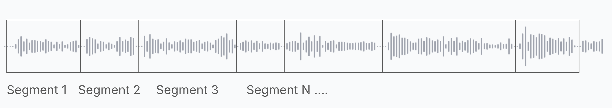

# Better Speech 🔈 with Voice Activity Detection

Mesolitica integrate Voice Activity Detection into Speech 🔈 API to improve accuracy for longer audio input by providing better audio chunking to the Speech 🔈 Engine.

Under the hood transcribing long audio
--------------------------------------

Because Mesolitica Speech 🔈 Engine can only understand a specific max audio length, so if the audio input is longer than the default max audio length processing, we chunked long audio into multiple segments after that for each segment we will pass to Speech 🔈 Engine to transcribe along with the timestamp, this method called **Naive Chunking**.

The transcription process for segments can be done simultaneously by simply group it a single batch, but for Mesolitica Speech 🔈 API, we prefer to do sequentially segments by segments to get better performance for streaming use case. So that is why we able to serve streaming tokens in the Speech 🔈 API.

Problem with Naive Chunking
---------------------------

Because you keep chunking with the exact segment size except for the last segment, this can introduce several issues,

1\. **Interrupted Speech**, the chunking process might split words, phrases, or sentences across segments, leading to incomplete or nonsensical transcriptions. For instance, a word or sentence could start in one segment and end in another, causing confusion or loss of meaning.

2\. **Misalignment with Pauses**, naive chunking may not align with natural pauses or breaks in speech, such as breaths or silence between sentences.

3\. **Inconsistent Quality**, some chunks might contain more speech than others, while others might be dominated by silence or background noise. This inconsistency can lead to uneven transcription quality, where some chunks are accurately transcribed, and others are not.

So to solve this problem, **we integrate Speech 🔈 API with Voice Activity Detection!**

Voice Activity Detection
------------------------

Or short is VAD, and VAD actually just a simple audio classifier to classify a very small sample of audio is a voice activity or not. So if we accumulate certain silent threshold, we counted it as an audio segment and this can help us to chunk the long audio with better pause alignments.

As you can see, the segment boxes properly separated on lower amplitude and usually lower amplitude means a silent period, while Naive Chunking is not.

In Speech 🔈 API, we provided 2 different VAD,

1\. WebRTC VAD, [https://webrtc.org/](https://webrtc.org/), a rule based VAD model and by default been use in WebRTC library to detect voice activities.

2\. Silero VAD, [https://github.com/snakers4/silero-vad](https://github.com/snakers4/silero-vad), a very small deep learning model.

Based on the [benchmark from Silero VAD](https://github.com/snakers4/silero-vad/tree/master?#silero-vad), Silero VAD is better in term of accuracy, but WebRTC VAD is much more faster.

Parameters for VAD
------------------

We introduced 5 new parameters in Speech 🔈 API, [https://api.mesolitica.com/scalar#tag/audio-transcription/POST/audio/transcriptions](https://api.mesolitica.com/scalar#tag/audio-transcription/POST/audio/transcriptions),

1\. **chunking\_method**, the method used for chunking the audio. Supported methods are,

*   'naive', Naive chunking, simple chunking without overlap.
*   'vad', Chunking based on Voice Activity Detection (VAD).

Default is 'naive', but to use VAD chunking, you must use 'vad' for **chunking\_method** parameter.

2\. **vad\_method**, the method used for Voice Activity Detection (VAD). Supported methods are,

*   'webrtc', uses the WebRTC VAD.
*   'silero', uses the Silero VAD.

Default is 'webrtc', but if you want better VAD accuracy, you can try 'silero' but this can impact the speed.

3\. **minimum\_silent\_ms**, default is 200, the minimum duration of silence (in milliseconds) required to consider it as a segment boundary.

4\. **minimum\_trigger\_vad\_ms**, default is 2000, the minimum duration of current segment to trigger VAD.

5\. **reject\_segment\_vad\_ratio**, default is 0.9, If the segment is 90% negative VAD, we will skip to transcribe the segment.

minimum silent milliseconds
---------------------------

As you can see figure above, there is a small red box between segment 1 and segment 2, the size of the small red box defined by **minimum\_silent\_ms**, if the silent detected reached at least **minimum\_silent\_ms** length, we conclude it as one segment.

minimum trigger VAD milliseconds
--------------------------------

When you use VAD, sometime the segments generated are too short if your audio input got too many pauses, and this can lead unaccurate transcription, so we suggest at least minimum 1 second for a segment.

reject segment VAD ratio
------------------------

Sometimes, for a segment, most of it may be just noise or silence,

So, if a segment like 90% just negative VAD, we want to reject to transcribe the segment. This can be set using **reject\_segment\_vad\_ratio**.

Comparison Naive Chunking vs VAD Chunking
-----------------------------------------

We use audio below as an example,

 Your browser does not support the audio element.

For Naive chunking using **Small** model,

As you can see, the output returned only one timestamp, and if you listen to the audio, the transcription is not fully complete. So to solve this problem, we can use VAD chunking using **Small** model,

Which is more perfect, but it can impact the speed, Naive Chunking can get up to 114 seconds per second while VAD Chunking only 15 seconds per second.

But different audio required different **minimum\_silent\_ms** and **minimum\_trigger\_vad\_ms** parameters to make it better transcription.

Feel free to try by yourself! We created some examples,

1. [Streaming using AIOHTTP](streaming-python.ipynb)
2. [Streaming using AIOHTTP with VAD](streaming-python-vad.ipynb)